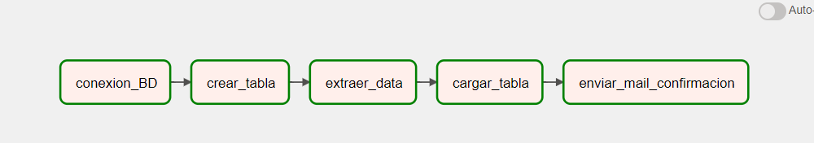
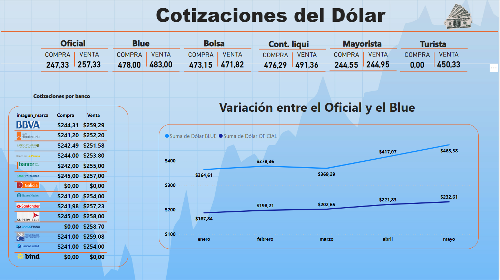

# Proyecto de Obtención de Cotizaciones del Dólar en Argentina

Este proyecto utiliza Python, Apache Airflow, Amazon Redshift y Docker para obtener y procesar las diferentes cotizaciones del dólar en Argentina. Proporciona una solución automatizada que te permite obtener de manera regular y confiable las tasas de cambio del dólar en el mercado argentino.

## Descripción

El objetivo principal de este proyecto es brindar una herramienta que facilite el seguimiento y análisis de las cotizaciones del dólar en Argentina. Utiliza Apache Airflow, una plataforma de orquestación de tareas, para programar y ejecutar de manera automatizada una serie de tareas relacionadas con la obtención de datos y su procesamiento. Los datos se almacenan en una base de datos en Amazon Redshift y se utilizan contenedores Docker para la ejecución del proyecto.

## Tecnologías utilizadas

Este proyecto utiliza las siguientes tecnologías:

- [Python](https://www.python.org/): Lenguaje de programación utilizado para implementar las diferentes funcionalidades del proyecto.
- [Apache Airflow](https://airflow.apache.org/): Plataforma de orquestación de tareas utilizada para programar y ejecutar los flujos de trabajo.
- [Amazon Redshift](https://aws.amazon.com/redshift/): Servicio de almacenamiento y análisis de datos en la nube utilizado para almacenar y consultar las cotizaciones del dólar.
- [Docker](https://www.docker.com/): Plataforma de contenedores utilizada para empaquetar y ejecutar la aplicación de manera portátil y reproducible.

## Bibliotecas utilizadas

Este proyecto hace uso de las siguientes bibliotecas de Python:

- `requests`: Utilizada para realizar solicitudes de datos a fuentes externas.
- `psycopg2`: Utilizada para la conexión y manipulación de la base de datos en Amazon Redshift.
- `pandas`: Utilizada para el procesamiento y análisis de datos.
- `smtplib`: Utilizada para el envío de correos electrónicos.

## Funcionalidades principales

- **Obtención de datos**: El proyecto realiza solicitudes a fuentes confiables de cotizaciones del dólar en Argentina, obteniendo los datos más recientes.
- **Almacenamiento en Amazon Redshift**: Las cotizaciones del dólar se almacenan en una base de datos en Amazon Redshift, lo que permite un acceso rápido y eficiente a los datos.
- **Procesamiento y análisis**: Se realizan transformaciones y cálculos sobre los datos obtenidos para obtener métricas relevantes, como tasas de cambio promedio, variaciones porcentuales, entre otros.
- **Generación de informes**: Se generan informes automatizados con los resultados del procesamiento, brindando una visión clara y actualizada de las cotizaciones del dólar en Argentina.
- **Programación y automatización**: Utilizando Apache Airflow, se programan y ejecutan las tareas de obtención, procesamiento y generación de informes de forma automatizada y programada.
- **Contenedores Docker**: Se utiliza Docker para empaquetar y ejecutar la aplicación de manera portátil y reproducible.

## Tareas realizadas por el DAG

El DAG (Directed Acyclic Graph) del proyecto consta de las siguientes tareas:

- `task_1`: Conexión a la base de datos - Esta tarea establece una conexión a la base de datos de Redshift. Utiliza la función `conexion_redshift` y recibe como argumento la fecha (`{{ ds }}`) y la hora de ejecución (`{{ execution_date.hour }}`).

- `task_2`: Crear tabla - Esta tarea crea una tabla en la base de datos. Utiliza la función `creacion_de_tablas`.

- `task_3`: Extraer datos - Esta tarea extrae datos de alguna fuente. Utiliza la función `extraer_data` y recibe como argumento la fecha (`{{ ds }}`) y la hora de ejecución (`{{ execution_date.hour }}`).

- `task_4`: Cargar tabla - Esta tarea carga los datos extraídos en la tabla previamente creada. Utiliza la función `cargar_datos` y recibe como argumento la fecha (`{{ ds }}`) y la hora de ejecución (`{{ execution_date.hour }}`).

- `task_5`: Enviar correo de confirmación - Esta tarea envía un correo electrónico de confirmación. Utiliza la función `enviar`.

Cada tarea desempeña un papel específico en el flujo de trabajo del proyecto y contribuye a la obtención y procesamiento de las cotizaciones del dólar en Argentina.

## Dashboard de Power BI

Puedes acceder al dashboard de Power BI para visualizar las cotizaciones del dólar en Argentina en el siguiente enlace:

[PBI Dashboard](https://app.powerbi.com/view?r=eyJrIjoiNTE4MzNhMDQtOWQxOC00MGFiLWIyNGQtMDlhZjYxNTU4YWUwIiwidCI6IjIzZTljOWRmLTM2NmEtNGJkMy1hZWYzLTc3NGM5MTY1ZjI2ZCJ9)

    

## Tecologias usadas

    
    
    
    
    

